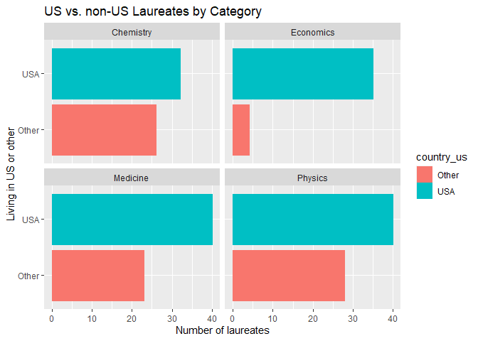
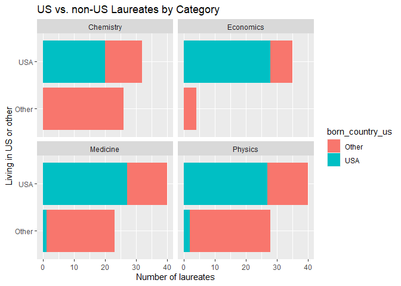

Lab 03 - Nobel laureates
================
Natalie Frye
2/10/2021

### Load packages and data

``` r
library(tidyverse) 
```

``` r
nobel <- read_csv("data/nobel.csv")
```

## Exercises

### Exercise 1

``` r
glimpse(nobel)
```

    ## Rows: 935
    ## Columns: 26
    ## $ id                    <dbl> 1, 2, 3, 4, 5, 6, 6, 8, 9, 10, 11, 12, 13, 14...
    ## $ firstname             <chr> "Wilhelm Conrad", "Hendrik A.", "Pieter", "He...
    ## $ surname               <chr> "Röntgen", "Lorentz", "Zeeman", "Becquerel", ...
    ## $ year                  <dbl> 1901, 1902, 1902, 1903, 1903, 1903, 1911, 190...
    ## $ category              <chr> "Physics", "Physics", "Physics", "Physics", "...
    ## $ affiliation           <chr> "Munich University", "Leiden University", "Am...
    ## $ city                  <chr> "Munich", "Leiden", "Amsterdam", "Paris", "Pa...
    ## $ country               <chr> "Germany", "Netherlands", "Netherlands", "Fra...
    ## $ born_date             <date> 1845-03-27, 1853-07-18, 1865-05-25, 1852-12-...
    ## $ died_date             <date> 1923-02-10, 1928-02-04, 1943-10-09, 1908-08-...
    ## $ gender                <chr> "male", "male", "male", "male", "male", "fema...
    ## $ born_city             <chr> "Remscheid", "Arnhem", "Zonnemaire", "Paris",...
    ## $ born_country          <chr> "Germany", "Netherlands", "Netherlands", "Fra...
    ## $ born_country_code     <chr> "DE", "NL", "NL", "FR", "FR", "PL", "PL", "GB...
    ## $ died_city             <chr> "Munich", NA, "Amsterdam", NA, "Paris", "Sall...
    ## $ died_country          <chr> "Germany", "Netherlands", "Netherlands", "Fra...
    ## $ died_country_code     <chr> "DE", "NL", "NL", "FR", "FR", "FR", "FR", "GB...
    ## $ overall_motivation    <chr> NA, NA, NA, NA, NA, NA, NA, NA, NA, NA, NA, N...
    ## $ share                 <dbl> 1, 2, 2, 2, 4, 4, 1, 1, 1, 1, 1, 1, 2, 2, 1, ...
    ## $ motivation            <chr> "\"in recognition of the extraordinary servic...
    ## $ born_country_original <chr> "Prussia (now Germany)", "the Netherlands", "...
    ## $ born_city_original    <chr> "Lennep (now Remscheid)", "Arnhem", "Zonnemai...
    ## $ died_country_original <chr> "Germany", "the Netherlands", "the Netherland...
    ## $ died_city_original    <chr> "Munich", NA, "Amsterdam", NA, "Paris", "Sall...
    ## $ city_original         <chr> "Munich", "Leiden", "Amsterdam", "Paris", "Pa...
    ## $ country_original      <chr> "Germany", "the Netherlands", "the Netherland...

There are 26 variables and 935 observations in this dataset. Each row
represents a nobel laureate.

### Exercise 2

``` r
nobel_living <- nobel %>%
  filter(
    !is.na(country),
    gender != "org",
    is.na(died_date)
    )
glimpse(nobel_living)
```

    ## Rows: 228
    ## Columns: 26
    ## $ id                    <dbl> 68, 69, 95, 97, 98, 99, 101, 103, 106, 107, 1...
    ## $ firstname             <chr> "Chen Ning", "Tsung-Dao", "Leon N.", "Leo", "...
    ## $ surname               <chr> "Yang", "Lee", "Cooper", "Esaki", "Giaever", ...
    ## $ year                  <dbl> 1957, 1957, 1972, 1973, 1973, 1973, 1974, 197...
    ## $ category              <chr> "Physics", "Physics", "Physics", "Physics", "...
    ## $ affiliation           <chr> "Institute for Advanced Study", "Columbia Uni...
    ## $ city                  <chr> "Princeton NJ", "New York NY", "Providence RI...
    ## $ country               <chr> "USA", "USA", "USA", "USA", "USA", "United Ki...
    ## $ born_date             <date> 1922-09-22, 1926-11-24, 1930-02-28, 1925-03-...
    ## $ died_date             <date> NA, NA, NA, NA, NA, NA, NA, NA, NA, NA, NA, ...
    ## $ gender                <chr> "male", "male", "male", "male", "male", "male...
    ## $ born_city             <chr> "Hofei Anhwei", "Shanghai", "New York NY", "O...
    ## $ born_country          <chr> "China", "China", "USA", "Japan", "Norway", "...
    ## $ born_country_code     <chr> "CN", "CN", "US", "JP", "NO", "GB", "GB", "US...
    ## $ died_city             <chr> NA, NA, NA, NA, NA, NA, NA, NA, NA, NA, NA, N...
    ## $ died_country          <chr> NA, NA, NA, NA, NA, NA, NA, NA, NA, NA, NA, N...
    ## $ died_country_code     <chr> NA, NA, NA, NA, NA, NA, NA, NA, NA, NA, NA, N...
    ## $ overall_motivation    <chr> NA, NA, NA, NA, NA, NA, NA, NA, NA, NA, NA, N...
    ## $ share                 <dbl> 2, 2, 3, 4, 4, 2, 2, 3, 2, 3, 4, 4, 3, 3, 2, ...
    ## $ motivation            <chr> "\"for their penetrating investigation of the...
    ## $ born_country_original <chr> "China", "China", "USA", "Japan", "Norway", "...
    ## $ born_city_original    <chr> "Hofei Anhwei", "Shanghai", "New York NY", "O...
    ## $ died_country_original <chr> NA, NA, NA, NA, NA, NA, NA, NA, NA, NA, NA, N...
    ## $ died_city_original    <chr> NA, NA, NA, NA, NA, NA, NA, NA, NA, NA, NA, N...
    ## $ city_original         <chr> "Princeton NJ", "New York NY", "Providence RI...
    ## $ country_original      <chr> "USA", "USA", "USA", "USA", "USA", "United Ki...

### Defining Dataframe

``` r
nobel_living <- nobel_living %>%
  mutate(
    country_us = if_else(country == "USA", "USA", "Other")
  ) 
```

``` r
nobel_living_science <- nobel_living %>%
  filter(category %in% c("Physics", "Medicine", "Chemistry", "Economics"))
```

### Exercise 3

``` r
ggplot(data = nobel_living_science, 
      mapping = aes(x = country_us,
                    color = country_us, fill = country_us)) +
    geom_bar() +
    coord_flip() +
    facet_wrap(~ category) +
  labs(title = "US vs. non-US Laureates by Category", 
       x = "Living in US or other",
       y = "Number of laureates") 
```

<!-- -->

It appears to be true that more nobel laureates were living in the US
when they received their prize than were living in other countries. This
imbalance is most true in the category of economics, and least true in
the category of chemistry.

### Exercise 4

``` r
nobel_living_science <- nobel_living_science %>%
  mutate(
    born_country_us = if_else(born_country == "USA", "USA", "Other")
  ) 
nobel_living_science %>%
  filter(born_country_us == "USA")
```

    ## # A tibble: 105 x 28
    ##       id firstname surname  year category affiliation city  country born_date 
    ##    <dbl> <chr>     <chr>   <dbl> <chr>    <chr>       <chr> <chr>   <date>    
    ##  1    95 Leon N.   Cooper   1972 Physics  Brown Univ~ Prov~ USA     1930-02-28
    ##  2   103 Ben R.    Mottel~  1975 Physics  Nordita     Cope~ Denmark 1926-07-09
    ##  3   106 Samuel C~ Ting     1976 Physics  Massachuse~ Camb~ USA     1936-01-27
    ##  4   107 Philip W. Anders~  1977 Physics  Bell Telep~ Murr~ USA     1923-12-13
    ##  5   112 Robert W~ Wilson   1978 Physics  Bell Labor~ Holm~ USA     1936-01-10
    ##  6   113 Sheldon   Glashow  1979 Physics  Harvard Un~ Camb~ USA     1932-12-05
    ##  7   115 Steven    Weinbe~  1979 Physics  Harvard Un~ Camb~ USA     1933-05-03
    ##  8   138 Jerome I. Friedm~  1990 Physics  Massachuse~ Camb~ USA     1930-03-28
    ##  9   143 Russell ~ Hulse    1993 Physics  Princeton ~ Prin~ USA     1950-11-28
    ## 10   144 Joseph H. Taylor~  1993 Physics  Princeton ~ Prin~ USA     1941-03-29
    ## # ... with 95 more rows, and 19 more variables: died_date <date>, gender <chr>,
    ## #   born_city <chr>, born_country <chr>, born_country_code <chr>,
    ## #   died_city <chr>, died_country <chr>, died_country_code <chr>,
    ## #   overall_motivation <chr>, share <dbl>, motivation <chr>,
    ## #   born_country_original <chr>, born_city_original <chr>,
    ## #   died_country_original <chr>, died_city_original <chr>, city_original <chr>,
    ## #   country_original <chr>, country_us <chr>, born_country_us <chr>

105 of the winners are born in the US. …

### Exercise 5

``` r
ggplot(data = nobel_living_science, 
      mapping = aes(x = country_us,
                    fill = born_country_us)) +
    geom_bar() +
    coord_flip() +
    facet_wrap(~ category) +
  labs(title = "US vs. non-US Laureates by Category", 
       x = "Living in US or other",
       y = "Number of laureates") 
```

<!-- -->

It’s true that many of the US-based nobel laureates were born in other
countries, although the majority of them were born in the US in every
category. Overall, I would say that Buzzfeed’s argument about the
importance of immigration to American science is valid, thought it might
deserve more nuance. …

### Exercise 6

``` r
nobel_living_science %>%
  filter(country == "USA" & born_country_us == "Other") %>%
  count(born_country) %>%
  arrange(desc(n))
```

    ## # A tibble: 21 x 2
    ##    born_country       n
    ##    <chr>          <int>
    ##  1 Germany            7
    ##  2 United Kingdom     7
    ##  3 China              5
    ##  4 Canada             4
    ##  5 Japan              3
    ##  6 Australia          2
    ##  7 Israel             2
    ##  8 Norway             2
    ##  9 Austria            1
    ## 10 Finland            1
    ## # ... with 11 more rows

…
